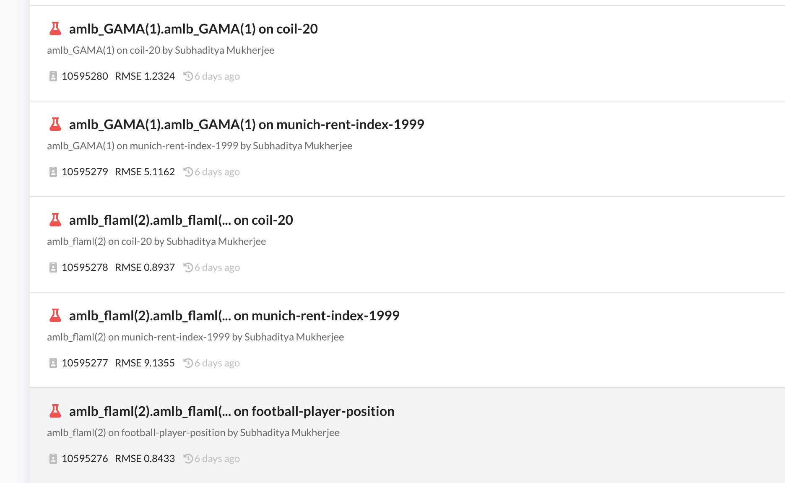

#### Updates
---
#### OpenML Pytorch
- Now tested by a bunch of students
- Upload almost all training information
- Custom loss function, optimizer ….
- Better plots
- Support for transformers
- Netron
- Limitations
	- Uploading metrics without a task/..
	- Size of model to upload
---
#### Auto-AutoML
- Well this works now :)
- It finds new datasets -> Creates a task -> Runs Automl frameworks -> Upload data back
---
- 
---
#### ML Course + Autograder
- Helping with this version of the course
	- TF -> Pytorch
	- OpenML Pytorch
- Daily feedback -> tests + AI feedback
---
#### General
- Optuna support