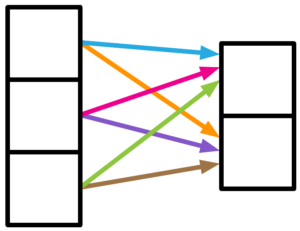

# Weak Relation Bias
- relationship between the neural units is weak, meaning that they’re somewhat independent of each other. The choice of including a fully connected layer in the net can represent this kind of relationship
- 

