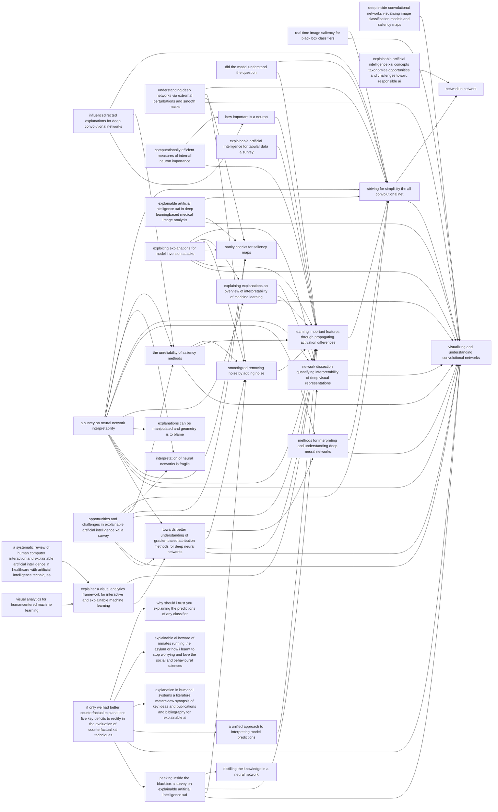

# XAI

```mermaid
graph LR;

Node_0[deep inside convolutional networks visualising image classification models and saliency maps]
Node_31[striving for simplicity the all convolutional net]
Node_35[the unreliability of saliency methods]
Node_3[real time image saliency for black box classifiers]
Node_33[network dissection quantifying interpretability of deep visual representations]
Node_5[understanding deep networks via extremal perturbations and smooth masks]
Node_36[methods for interpreting and understanding deep neural networks]
Node_38[explaining explanations an overview of interpretability of machine learning]
Node_8[explainable artificial intelligence xai concepts taxonomies opportunities and challenges toward responsible ai]
Node_9[did the model understand the question]
Node_29[smoothgrad removing noise by adding noise]
Node_34[how important is a neuron]
Node_12[computationally efficient measures of internal neuron importance]
Node_30[learning important features through propagating activation differences]
Node_46[a unified approach to interpreting model predictions]
Node_15[influencedirected explanations for deep convolutional networks]
Node_40[towards better understanding of gradientbased attribution methods for deep neural networks]
Node_17[a survey on neural network interpretability]
Node_18[opportunities and challenges in explainable artificial intelligence xai a survey]
Node_19[explainable artificial intelligence for tabular data a survey]
Node_47[peeking inside the blackbox a survey on explainable artificial intelligence xai]
Node_21[explainable artificial intelligence xai in deep learningbased medical image analysis]
Node_22[a systematic review of human computer interaction and explainable artificial intelligence in healthcare with artificial intelligence techniques]
Node_42[explainer a visual analytics framework for interactive and explainable machine learning]
Node_24[visual analytics for humancentered machine learning]
Node_25[exploiting explanations for model inversion attacks]
Node_26[if only we had better counterfactual explanations five key deficits to rectify in the evaluation of counterfactual xai techniques]
Node_27[visualizing and understanding convolutional networks]
Node_28[network in network]
Node_32[sanity checks for saliency maps]
Node_37[interpretation of neural networks is fragile]
Node_39[explanations can be manipulated and geometry is to blame]
Node_41[distilling the knowledge in a neural network]
Node_43[why should i trust you explaining the predictions of any classifier]
Node_44[explainable ai beware of inmates running the asylum or how i learnt to stop worrying and love the social and behavioural sciences]
Node_45[explanation in humanai systems a literature metareview synopsis of key ideas and publications and bibliography for explainable ai]
Node_0 --> Node_27
Node_31 --> Node_28
Node_31 --> Node_27
Node_35 --> Node_29
Node_35 --> Node_30
Node_35 --> Node_27
Node_3 --> Node_31
Node_3 --> Node_27
Node_33 --> Node_27
Node_5 --> Node_31
Node_5 --> Node_29
Node_5 --> Node_32
Node_5 --> Node_27
Node_36 --> Node_31
Node_36 --> Node_27
Node_38 --> Node_33
Node_38 --> Node_30
Node_38 --> Node_27
Node_8 --> Node_28
Node_9 --> Node_31
Node_9 --> Node_30
Node_29 --> Node_30
Node_34 --> Node_30
Node_12 --> Node_34
Node_12 --> Node_30
Node_30 --> Node_31
Node_46 --> Node_30
Node_15 --> Node_31
Node_15 --> Node_35
Node_15 --> Node_34
Node_40 --> Node_36
Node_40 --> Node_29
Node_40 --> Node_30
Node_40 --> Node_27
Node_17 --> Node_31
Node_17 --> Node_37
Node_17 --> Node_35
Node_17 --> Node_33
Node_17 --> Node_36
Node_17 --> Node_38
Node_17 --> Node_39
Node_17 --> Node_32
Node_17 --> Node_30
Node_17 --> Node_27
Node_17 --> Node_40
Node_18 --> Node_31
Node_18 --> Node_37
Node_18 --> Node_35
Node_18 --> Node_32
Node_18 --> Node_30
Node_18 --> Node_27
Node_18 --> Node_40
Node_19 --> Node_30
Node_47 --> Node_41
Node_47 --> Node_33
Node_47 --> Node_29
Node_47 --> Node_27
Node_21 --> Node_31
Node_21 --> Node_32
Node_21 --> Node_27
Node_22 --> Node_42
Node_42 --> Node_30
Node_42 --> Node_40
Node_24 --> Node_42
Node_25 --> Node_33
Node_25 --> Node_38
Node_25 --> Node_29
Node_25 --> Node_32
Node_25 --> Node_30
Node_25 --> Node_27
Node_26 --> Node_43
Node_26 --> Node_44
Node_26 --> Node_45
Node_26 --> Node_46
Node_26 --> Node_27
Node_26 --> Node_47
```

