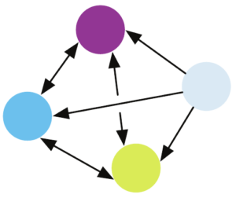

# Arbitrary Relation Bias
- To solve problems related to a group of things or people, it might be more informative to see them as a [Graphs](Graphs.md). The graph structure imposes arbitrary relationships between the entities, which is ideal when there’s no clear sequential or local relation in the model:
- 

