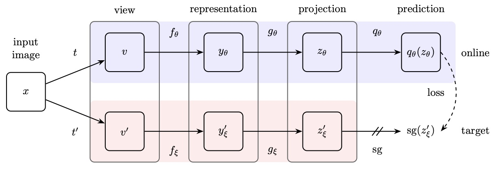

---

title: BYOL Loss

tags: loss 

---

# [BYOL](BYOL.md) Loss
- Similarity loss between $q_\theta (z_\theta)$ and $sg(z^{'}_{\xi})$
- $\theta$ is trained weights
- $\xi$ is exponentially moving average of $\theta$ and sg is stop gradient
- $f_\theta$ is discarded, $y_\theta$ is used as image representation
- 

