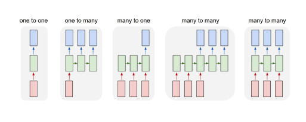

# Basic RNN Architectures

- [Recurrent](Recurrent.md)
- [[SRN]]
- [[Stacking RNN]]
- [[Bi Directional RNN]]
- [[Seq2Seq]]
- [[Temporal Conv]]
- [[Gated Recurrent Unit (GRU)]]
- [Long Short Term Memory (LSTM)](Long%20Short%20Term%20Memory%20(LSTM).md)

