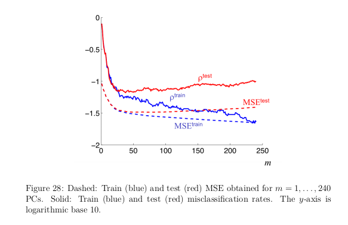
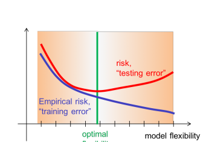
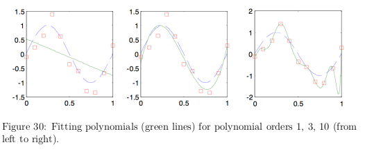
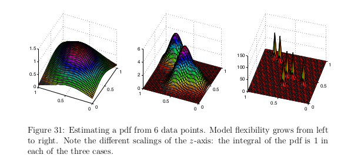
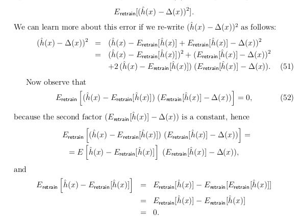
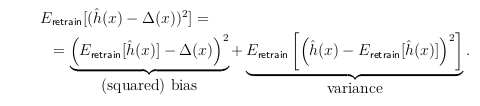

# Bias Vs Variance
- 
- 
	- m is choices of PC vectors
	- as m increases, weight matrices grow by $10\cdot m$ . Aka more flexible models.
	- Increasing tail of MSEtest -> overfitting. too flexible
	- Increasing flexibility -> decrease of empirical risk
	- Inc : very low to very high -> less and less underfitting then overfitting
	- Best: min point in curve. But it is defined on test data which we do not have
- 
- 
- Decision function should minimize [[LossFunctions]] and yield a function with risk h. This is hopeless $$R(h) = E[L(h(X), Y)]$$
- Tune on [[Emperical Risk]] instead using [[Optimizers]]
- $\mathcal{H}$ is hypothesis space (related to [[Fitting]]).
## Why is This a Dilemma
- Any learning algo $\mathcal{A}$
- If we run $\mathcal{A}$ repeatedly but for different "fresh" sampled data -> $\hat h$ varies from trial to trial
- For any fixed x, $\hat h(x)$
	- is a random variable
	- value determined by drawn training samples
	- rep by distribution $P_{X,Y}$  (which we cannot really know)
	- Expectation $E_{retrain}[\hat h(x)]$ . aka taken over ALL possible training runs with sampled data
- [[Quadratic Loss]] (risk) is minimized by the function $$\Delta(x) = E_{Y|X=x}[Y]$$
	- Expectation of Y given x.
- 
- 
- Bias measures how strongly the avg result deviates from optimal value
- Variance measures how strongly the results vary around the expected value $E_{retrain}$
- When flexibility is too low -> bias dominates(too good in train and horrible later) and underfits
- When flexibility is too high -> variance dominates -> overfitting
## [[Tuning Model Flexibility]]

