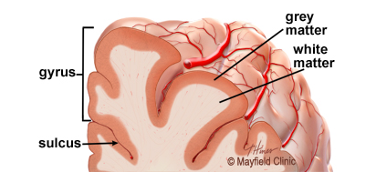

# Brain Cortex
- It has a folded appearance with hills and valleys
- The nerve cell bodies color the cortex grey-brown giving it its name – gray matter
- Beneath the cortex are long nerve fibers (axons) that connect [[brain areas]] to each other — called white matter
- 
- [[Gyrus]]
- [[Basal Ganglia]]

**

