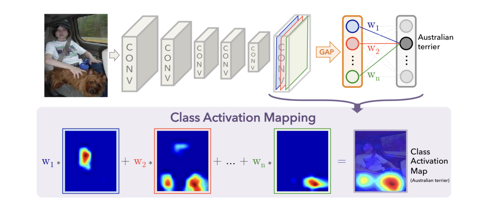

# CAM
- Zhou et al. 2016
```toc
```
- Class Activation Mapping
- Similar to [[Network In Network]]
- zeroes out the negative grads during backward pass to provide more visually appealing results
- Uses [[Global Average Pooling]]
- 
- $$\alpha_{k}^{c}= \overbrace{\frac{1}{Z}\Sigma_{i}\Sigma_{j}}^\text{global avg pool} \underbrace{\frac{\partial y^{c}}{\partial A^{k}_{ij}}}_\text{grads via backprop}$$
- k is the index of the activation map in the last convolutional layer, and c is the class of interest. Alpha computed above shows the importance of feature map _k_ for the target class _c_.
- Finally, we multiply each activation map by its importance score (i.e. alpha) and sum the values

