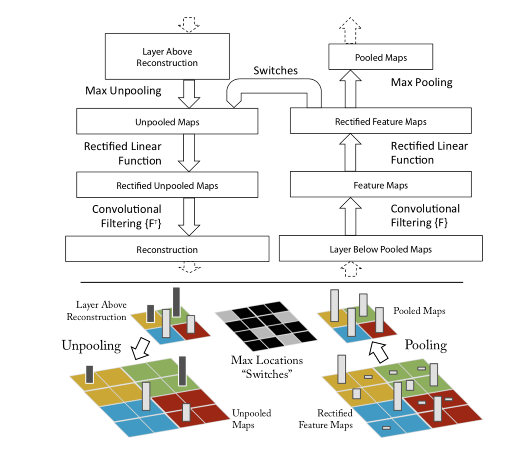

# DeconvNet
- [[@Visualizing and Understanding Convolutional Networks]]
- Zeiler, Fergus
- [Arxiv](https://arxiv.org/abs/1311.2901)
  ```toc
  ```
- 
- 
- Basically invert operations between input and the chosen layer.
	- Conv -> Deconv
	- Pool -> Unpooling
	- ReLU -> ReLU with negative valyes clamped going backward from the activation space to image space
	- Pooling is non invertible, but uses a switch module : recover positions of maxima in the forward pass
- DeconvNet is a calculation of a backward convolutional network that reuses the weights at each layer from the output layer back to the input image
- The employed mechanisms are deconvolution and unpooling, which are especially designed for CNNs with convolutions, max-pooling, and Rectified Linear Units (ReLUs). The method makes it possible to create feature maps of an input image that activates certain hidden units most, linked to a particular prediction
- With their propagation technique, they identified the most responsible patterns for this output. The patterns are visualized in the input space
- DeconvNet is limited to max-pooling layers, but the unpooling uses an approximate inverse
## Backlinks

> - [Vision Explainibility](Vision Explainibility.md)
>   - Building up on [Deep Inside Convolutional Networks](Deep%20Inside%20Convolutional%20Networks.md) and [[DeconvNet]]

_Backlinks last generated 2023-01-28 14:37:47_