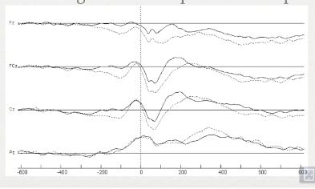

# EEG Baseline Correction
- Signal drifts
- Adjust pre stimulus value by averaging across pre stimulus points during baseline period
- Subtract average value from post stimulus period
- Period where nothing is going on
- 100-200 ms
- 

