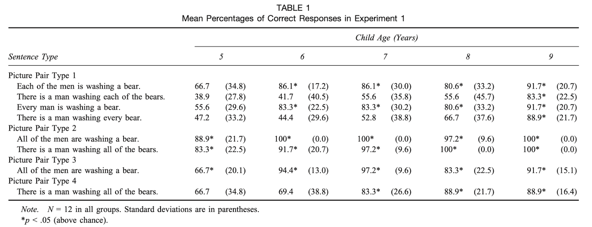

# Final Paper LM
```toc
```

## Tips
- Identify a Research Question that links with previous research
- Identify a Method that will let you answer the research question, or at least partially
- Develop an experiment (or two) that would then test this research question
- Predict what the results will look like given current theory/theories  
	If your experiment tests the predictions of more than one theory then you should have one set of predictions for each theory  
- What are the consequences of certain results for our understanding of the phenomena studied?
- What should following research do given certain results?
- How will you analyze the results statistically? What methods, which tests, what does your data look like?

## Idea.
- [[../Shortcuts to Quantifier Interpretation in Children and Adults]] But studies and comparisons were weird. Change?
- They were salty about This feature of their design provided children with unambiguous cues as to which set of entities was the focus of attention. : Crain and Thornton (1998)
- Crain et al.’s (1996) claim that preschoolers have full competence with uni- versal quantifiers would seem to be undermined by the fact that even older school-age children make errors identifying the domain of a universal quantifier.
- 
- Brooks and Braine (1996, Experiment 1) tested adults with actional scenes and found no errors. Their data, however, came from 10 undergraduates at a highly selective private university (Carnegie Mellon) and thus may not be representative of adults in general.
- Test same thing as Shorts. but different data
- Pictures

## Literature
- [[Quantifier spreading children misled by ostensive cues]]
- [[Shortcuts to Quantifier Interpretation in Children and Adults]]

