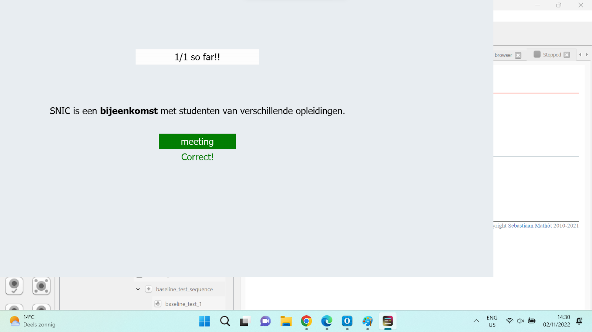
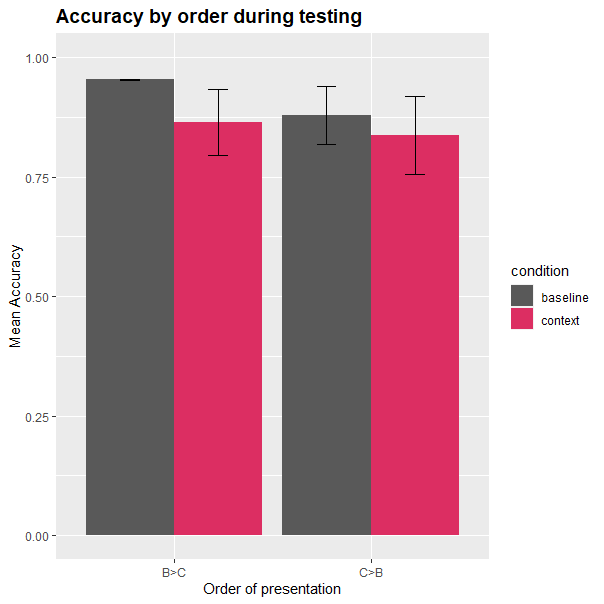

# Final Paper User Models
```toc
```

## Literature
- van den Broek, G. S., Takashima, A., Segers, E., & Verhoeven, L. (2018). Contextual richness and word learning: Context enhances comprehension but retrieval enhances retention. Language learning, 68(2), 546-585.
- [Effects_of_Contextual_Cues_on_Inferring_and_Remembering_Meanings_of_New_Word](Effects_of_Contextual_Cues_on_Inferring_and_Remembering_Meanings_of_New_Word.md)
- [SlimStampen](SlimStampen.md)
- [The_Behavior_of_Tutoring_Systems](The_Behavior_of_Tutoring_Systems.md)
- [[The_Effect_of_Three_Consecutive_Context_Sentences_on_EFL_Vocabulary-Learning]]
- [[Second_Language_Vocabulary_Learning_,_The_role_of_context__versus_translation]]
- [[Learning_L2_German_Vocabulary_Through_Reading]]

## Members
- Hila Schwartz
- Juliette Bruin
- Isabelle Tilleman
- Subhaditya Mukherjee

## Concept
- Outlines the general concept of our system, meaning how we tried to adjust and improve the slimstampen system, and any additional improvements we made to the system.

### Main Idea
- The main idea we have for this project is to improve the SlimStampen system by presenting vocabulary in context. The way we would like to do this, is by presenting users with the word they need to learn in a sentence. As the learner gets better, the system will increase the difficulty by presenting words without context. If the words are presented out of context and the user makes a mistake, the correct answer will also be shown without context.
- An example of this would be as follows:
- Prompt: Wij kopen een huis
- Correct answer: to buy OR buy OR buying
- This idea is based on research by van den Broek et al. (2018), which showed that presenting novel words in context during the initial learning phase, and then reducing context later on improves long-term word retention. Next to that, Li (1988) found that learning words in context improves understanding of the word.
- Based on previous feedback, we have decided to have two contexts for each word. If a user gets a word wrong consistently, they will be shown a different context. This is based on the idea that they perhaps do not understand the first context they were provided with, and that perhaps the second context will provide them with the information they need to get the word correct. Unlike previously stated, this addition will not be tested in a separate condition. The only conditions we will test are no contexts at all and two contexts.

## Params
- WORD_THRESHOLD = 0.29
- CONTEXT2_THRESHOLD = 0.35
- DEFAULT_ALPHA = 0.3

## Fact
```py
Fact(fact_id = 6, 
 question = 'gemiddeld', 
 context_1 = "Deze opleiding heeft 'gemiddeld' …", 
 context_2 = "De temperatuur is 'gemiddeld' …", 
 answer = 'average', 
 chosen_context = "Deze opleiding heeft 'gemiddeld' …",
 encounter_2 = True)
```

### Additional Improvements
- We added a few things to the system of which we will not test the effects:

### 1 UI Improvements
- The UI was updated for a cleaner look and feel, as well as to improve readability for dyslexic participants.

### 2 Gamification
- We have decided to add a few small gamification elements. One of those is that through the use of colors (green/red). Another is displaying a score which shows how many answers you got correct out of the total number of trials you have done so far.

### 3 Multiple Translations
- For some of the words, we added multiple correct answers. This means that multiple different answers can be counted as correct. This is especially useful for verbs, since there are different ways to translate those which do not really change the meaning of the words. An example of this is the word vergeten, which can be translated to forget, to forget, and forgot. Out-of-context, all three of these meanings make sense. Having multiple options be marked as correct also helped with gathering context sentences, since you are not as restricted to one specific use of the word.

## System
- Explains how the system itself works, meaning how it switches between words and context, and how it decided which word to show next.

### Word Order
- Similarly to the set-up of slimstampen, we let the system decide which words to show and how based on rate of forgetting. What we changed is that we have different thresholds for when it shows the context, which context it shows, and when it shows just the word.
- Once it enters the second context, it will not go back to the first. This is based on the assumption that the first context did not help the participant figure out the meaning of the word. Thresholds were decided through trial-and-error, based on what felt like a natural progression of conditions.
- In the original system, the same word (and in this case also context) was shown thrice without changing at all based on input. We changed that to twice in our system.

## Testing
- Explains how we aim to test the system, including each of the conditions and the full experimental procedure.

### Stimuli and Design
- To test whether the improvements we made to the SlimStampen system have an effect on word retrieval, we want to do a within-participant study. For each condition, we will vary whether words are presented in a sentence, and how many sentences are available. The independent variables in this study are accuracy and response time. The dependent variable is number of contexts available.

### Conditions
- We are planning to have two conditions:
- Baseline condition: In this condition, participants are only shown words without context.
- Two-context condition: In this condition, participants will be presented with words in-context as well as out of context. If participants repeatedly give the wrong answer when an item is shown in-context, they will be shown a different context.

### Components
- The experiment consists of different components:
- Questionnaire: This will ask the participants for some basic info: age, their native language, and their previous experience with learning Dutch.
- Level Evaluation: Participants will be shown 20 Dutch words and will be asked to translate them to English. We can use this data to compare the Dutch level of each participant, in case we see some weird results. The words were chosen by taking vocabulary from different levels of Dutch (a1-b2).
- Training: Participants will try to learn new Dutch words using our adapted SlimStampen system. This is where the conditions come into play. This segment lasts either 150 trials or until they have seen all words.
- Distractor: A small dot-counting task that functions as a distractor task. Participants need to do this 10 times between training and testing. The number of blue dots that are shown is between 10 and 20.
- Test: Participants will be tested on the words learned during training using a simple translation task. In this test, they are only presented with words that they saw during training. They immediately receive feedback on how they did.
- Break: Participants will be asked to take a small break between testing and starting the training in a new condition.
- We will present each participant with the same two word/context lists, but they will be randomized over the conditions. The order of the conditions will also be randomized.

### Procedure
- The experiment will be performed on our personal laptops using OpenSesame in a quiet place. Participants will be presented with a small introduction to the experiment. Then, they will answer a small questionnaire about their Dutch level. After that, they will do a small Dutch test. All participants will be asked to do the same Dutch test. The words in this test will not be used in any of the conditions. This test will provide a frame of reference for each participant's Dutch level, in case we see unexpected results. After the test, there is a small break.
- Next, participants will be asked to practice a word list in one of the two conditions. This finishes after 150 trials or after a participant has seen all of the words. Next, participants will do a small distractor test. In this distractor test, they are asked to count dots. They need to do this 10 times. Then, we will test their word retrieval with a simple single-word translation test. After this, participants are asked to take a small break. This process is repeated a total of 2 times, once for each of the conditions.
- After each participant has done each of the two conditions, we will end the experiment by thanking them for their efforts.

## Results
- Not significant ):
- Not effective for all learners 
- Short time frame
- Effect : Using words in sentences vs Retrieval (Prince, 1996)

## Limitations
- Very small participant pool
- Variation in participant backgrounds
- Ceiling effect
- No external motivation to do well
- Not enough attention to the context

## Future Directions
- Additional focus on gamification
- Longer term studies (Like SlimStampen)
- Harder words : Ceiling Effect
- More informed context in sentences (van den Broek et al., 2018) 
- Other ways of testing context
- Investigate thresholds

    

### Pictures
- ****
- ****
- 
- 
- 
- 
- ****
- ****
- ****
- ****
- ****

