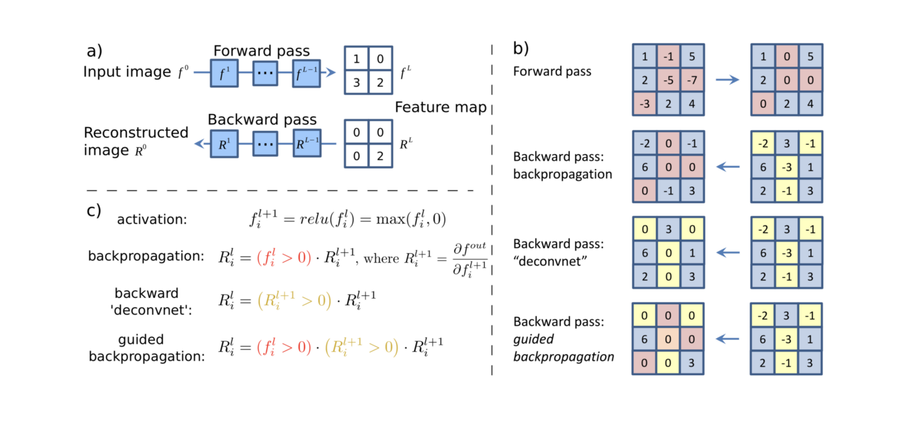
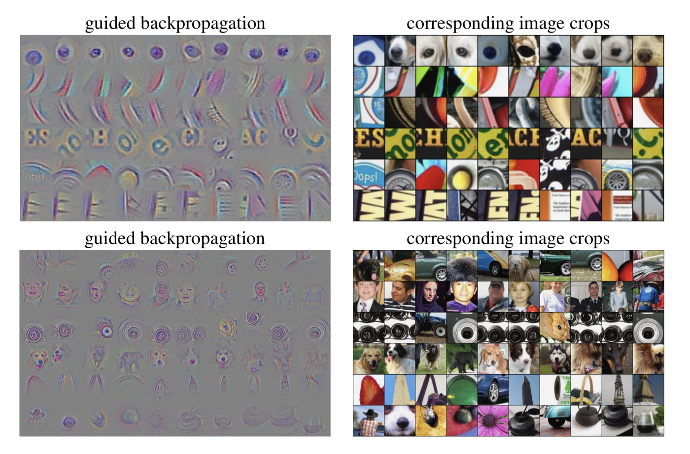

# Guided BackProp
```toc
```
- @springenbergStrivingSimplicityAll2015
- Striving for simplicity, the All conv net
## Summary
- Combination of [[DeconvNet]] and  [[Deep Inside Convolutional Networks]] 
- [[DeconvNet]] has an issue with flow of negative gradients which decrease accuracy of higher layers
- Their idea is to combine two approaches and add a “guide” to the Saliency with the help of deconvolution.
- focus on the ReLU activation function
- When computing values at the Rectification component of the deconvnet, we are masking all non-positive values with the ReLU
- In that layer, the computed values are calculated only base on the top signal (reconstruction from the upper layer), and the input is ignored
- On the other hand, in the Saliency method, we are focusing on the gradient values computed base on the input image
- If we take deconvnet masking of the Rectification layer and apply it on the gradient values of the Saliency method, we could remove noise caused by the negative gradient values.
- Deconvolution guides backpropagation values of the Saliency method to produce sharper images
- The idea of GBP is often misunderstood and interpreted as “applying deconvolution results on the saliency results”.
- This is not true because ReLU masking extracted from the deconvnet is applied on every level and therefore affects the gradient values all the way down to the input of the CNN, not only at the first level of the CNN
## Images
- ![[images/Pasted image 20230310115413.png]]
- 
- 

## Backlinks

> - [Salience Map](Salience Map.md)
>   - [[Guided BackProp]]
>    
> - [Guided [[Grad-CAM]]](Guided GradCAM.md)
>   - Pointwise multiply betwen [[Grad-CAM]] and [[Guided BackProp]]

_Backlinks last generated 2023-04-11 15:00:45_
