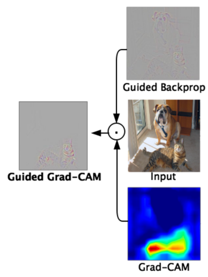

# Guided GradCAM
```toc
```

- Pointwise multiply betwen [[CAM]] and [GradCAM](GradCAM.md)
- Class Discriminative
- High resolution
- Similar to [[Occlusion Map]] but faster
- 

## Backlinks

> - [GradCAM](GradCAM.md)
>   - Followed by [[Guided GradCAM]]

_Backlinks last generated 2022-11-24 10:39:19_
