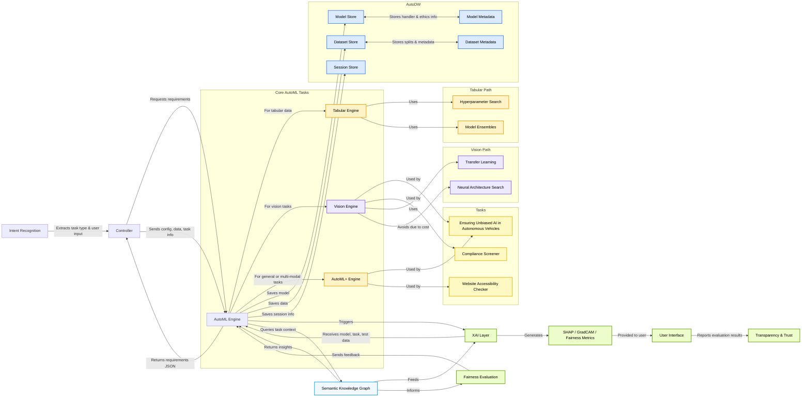
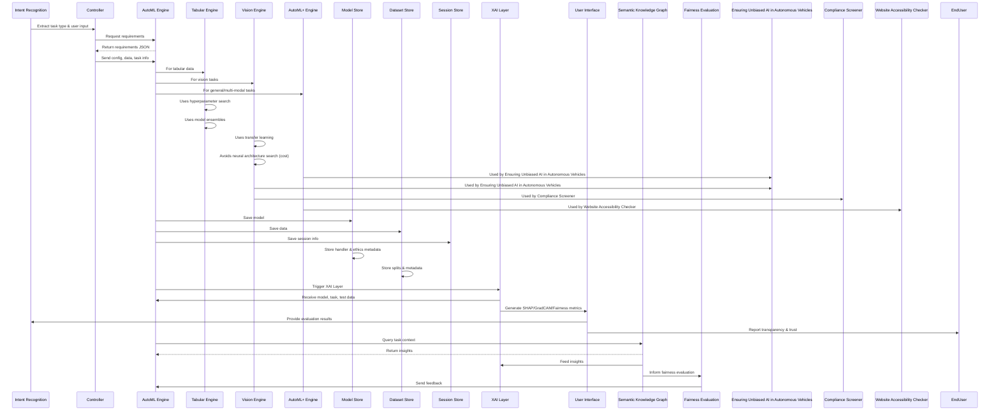

# architecture charts
```toc
```

```mermaid
flowchart LR

%% Intent and Control

A[Intent Recognition] -->|Extracts task type & user input| B[Controller]

B -->|Requests requirements| C[AutoML Engine]

C -->|Returns requirements JSON| B

B -->|Sends config, data, task info| C

  

%% Core AutoML Tasks

subgraph Core_AutoML_Tasks["Core AutoML Tasks"]

D[Tabular Engine]

E[Vision Engine]

F[AutoML+ Engine]

C -->|For tabular data| D

C -->|For vision tasks| E

C -->|For general or multi-modal tasks| F

end

  

%% Tasks Using Engines

subgraph Tasks["Tasks"]

T1[Ensuring Unbiased AI in Autonomous Vehicles]

T2[Compliance Screener]

T3[Website Accessibility Checker]

F -->|Used by| T1

E -->|Used by| T1

E -->|Used by| T2

F -->|Used by| T3

end

  

%% Tabular Path

subgraph Tabular_Path["Tabular Path"]

D2[Hyperparameter Search]

D3[Model Ensembles]

D -->|Uses| D2

D -->|Uses| D3

end

  

%% Vision Path

subgraph Vision_Path["Vision Path"]

E2[Transfer Learning]

E3[Neural Architecture Search]

E -->|Uses| E2

E -->|Avoids due to cost| E3

end

  

%% Data & Model Storage (AutoDW)

subgraph AutoDW["AutoDW"]

G[Model Store]

H[Dataset Store]

I[Session Store]

C -->|Saves model| G

C -->|Saves data| H

C -->|Saves session info| I

  

G1[Model Metadata]

H1[Dataset Metadata]

  

G <-->|Stores handler & ethics info| G1

H <-->|Stores splits & metadata| H1

end

  

%% Explainability (XAI Layer)

C -->|Triggers| J[XAI Layer]

J -->|Receives model, task, test data| C

J1[SHAP / GradCAM / Fairness Metrics]

J -->|Generates| J1

J1 -->|Provided to user| K[User Interface]

K -->|Reports evaluation results| L[Transparency & Trust]

  

%% Semantic & Fairness

C -->|Queries task context| M[Semantic Knowledge Graph]

M -->|Returns insights| C

M -->|Feeds| J

M -->|Informs| N[Fairness Evaluation]

N -->|Sends feedback| C

  

%% Styles

classDef core fill:#fef3c7,stroke:#f59e0b,stroke-width:2px,color:black;

classDef data fill:#dbeafe,stroke:#3b82f6,stroke-width:2px,color:black;

classDef vision fill:#ede9fe,stroke:#8b5cf6,stroke-width:2px,color:black;

classDef xai fill:#ecfccb,stroke:#65a30d,stroke-width:2px,color:black;

classDef external fill:#f0f9ff,stroke:#0ea5e9,stroke-width:2px,color:black;

classDef task fill:#fef9c3,stroke:#eab308,stroke-width:2px,color:black;

  

class D,D2,D3,F core;

class E,E2,E3 vision;

class G,H,I,G1,H1 data;

class J,J1,K,L,N xai;

class M external;

class T1,T2,T3 task;
```


```mermaid
sequenceDiagram

participant User as Intent Recognition

participant Controller

participant AutoML as AutoML Engine

participant Tabular as Tabular Engine

participant Vision as Vision Engine

participant AutoMLPlus as AutoML+ Engine

participant ModelStore as Model Store

participant DatasetStore as Dataset Store

participant SessionStore as Session Store

participant XAI as XAI Layer

participant UI as User Interface

participant SKG as Semantic Knowledge Graph

participant FairEval as Fairness Evaluation

  

User->>Controller: Extract task type & user input

Controller->>AutoML: Request requirements

AutoML-->>Controller: Return requirements JSON

Controller->>AutoML: Send config, data, task info

  

AutoML->>Tabular: For tabular data

AutoML->>Vision: For vision tasks

AutoML->>AutoMLPlus: For general/multi-modal tasks

  

Tabular->>Tabular: Uses hyperparameter search

Tabular->>Tabular: Uses model ensembles

  

Vision->>Vision: Uses transfer learning

Vision->>Vision: Avoids neural architecture search (cost)

AutoMLPlus->>Ensuring Unbiased AI in Autonomous Vehicles: Used by Ensuring Unbiased AI in Autonomous Vehicles

Vision->>Ensuring Unbiased AI in Autonomous Vehicles: Used by Ensuring Unbiased AI in Autonomous Vehicles

Vision->>Compliance Screener: Used by Compliance Screener

AutoMLPlus->>Website Accessibility Checker: Used by Website Accessibility Checker

  

AutoML->>ModelStore: Save model

AutoML->>DatasetStore: Save data

AutoML->>SessionStore: Save session info

  

ModelStore->>ModelStore: Store handler & ethics metadata

DatasetStore->>DatasetStore: Store splits & metadata

  

AutoML->>XAI: Trigger XAI Layer

XAI->>AutoML: Receive model, task, test data

XAI->>UI: Generate SHAP/GradCAM/Fairness metrics

UI->>User: Provide evaluation results

UI->>EndUser: Report transparency & trust

  

AutoML->>SKG: Query task context

SKG-->>AutoML: Return insights

SKG->>XAI: Feed insights

SKG->>FairEval: Inform fairness evaluation

FairEval->>AutoML: Send feedback
```
