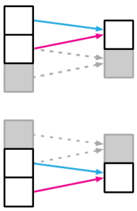

# Locality
- [Localist units](Localist%20units.md)
- In order to process an image, we start by capturing the local information. One way to do that is the use of a convolutional layer. It can capture the local relationship between the pixels of an image. Then, as we go deeper in the model, the local feature extractors help to extract the global features
- 

