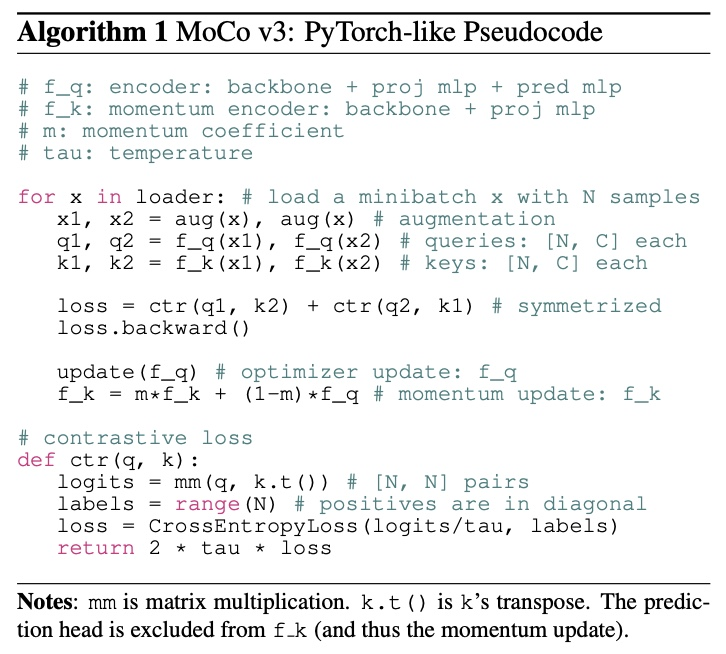

---

title: Self Supervised Vision Transformers

tags: architecture

---

# Self Supervised Vision Transformers
- [An Empirical Study of Training Self-Supervised Vision Transformers](https://arxiv.org/abs/2104.02057)
	- recipes for [Vision Transformer](Vision%20Transformer.md) are yet to be built
	- [Self Supervised](Self%20Supervised.md)
	- instability is a major issue that degrades accuracy, and it can be hidden by apparently good results
	- improved when training is made more stable
	- [MoCO](MoCO.md) v3, a framework which offers an incremental improvement of [MoCO](MoCO.md)
	- 

