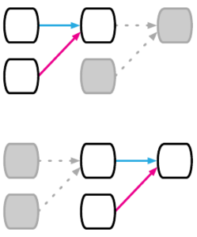

# Sequential Relation Bias
- Sometimes our data has a sequential characteristic. For instance, [time series](TIme%20Series.md) and sentences consist of sequential elements that appear one after another. To model this pattern, we can introduce a [Recurrent](Recurrent.md) layer to our network:
- 

