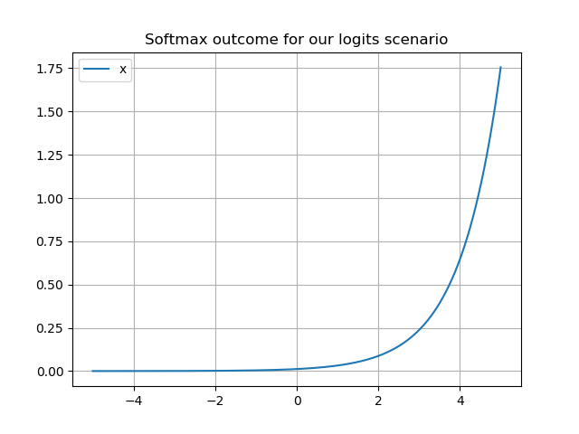

# Softmax
- Output : probabilities
- $$p = \frac{1}{\Sigma_{i = 1, .., n}e^{\frac{\alpha y_{i}}{T}}}(e^{\frac{\alpha y_{1}}{T}} , e^{\frac{\alpha y_{2}}{T}} , …, e^{\frac{\alpha y_{n}}{T}})'$$
- Softer argmax (0,1)
- Multinoulli

## [Entropy](Entropy.md)
- $\alpha$ determines [entropy](Entropy.md)
- If it is 0, and [Uniform Distribution](Uniform%20Distribution.md) and limit to infinity -> binary vector which is 0 everywhere except at position i when y is maximal

## Temperature
- Higher the T -> Softer it the distribution. Aka less confident about distribution
- Lower -> Harder. More confident
- 

