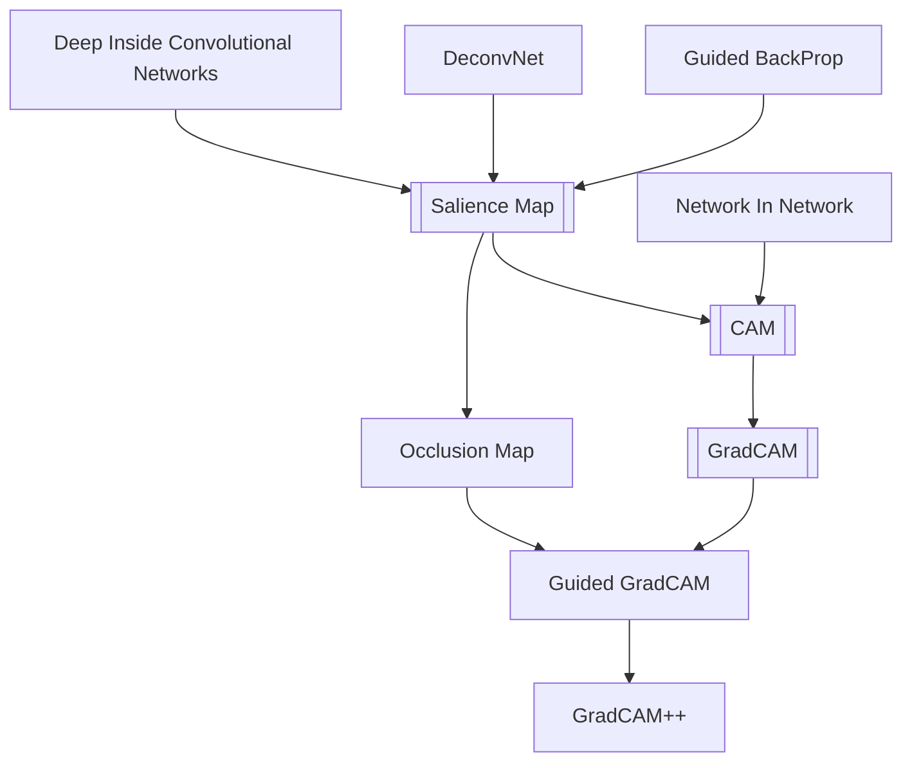

# Vision Explainibility
```toc
```

## Flow
- [DeconvNet](DeconvNet.md)
- [Deep_Inside_Convolutional_Networks](Deep_Inside_Convolutional_Networks.md)
- [Guided_BackProp](Guided_BackProp.md)
- [Salience_Map](Salience_Map.md)
	- Not class discriminative
	- Noise
	- Not appealing
- [Guided_BackProp](Guided_BackProp.md)
	- Building up on [Deep_Inside_Convolutional_Networks](Deep_Inside_Convolutional_Networks.md)
- [CAM](CAM.md)
	- less noisy
	- not class discriminative
	- Worked only a restricted set of CNN templates
- [GradCAM](GradCAM.md)
	- class discriminative
	- not high res
	- Works for any arbitrary CNN
- [Occlusion Map](Occlusion%20Map)
	- Same as the next but not very fast
- [Guided_GradCAM](Guided_GradCAM.md)
	- 
	


