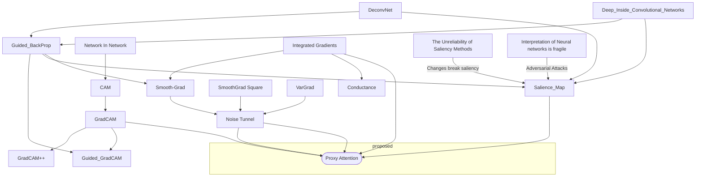

# Vision Explainibility

## Links Useful
- [Captum Algos Comparison](https://captum.ai/docs/algorithms_comparison_matrix)

## Flow
- [DeconvNet](DeconvNet.md) (2013)
- [Deep_Inside_Convolutional_Networks](Deep_Inside_Convolutional_Networks.md) (2014)
- [Guided_BackProp](Guided_BackProp.md) (2015) Aka All Conv net
	- Building up on [Deep_Inside_Convolutional_Networks](Deep_Inside_Convolutional_Networks.md) and [[DeconvNet]]
- [Salience_Map](Salience_Map.md)
	- Not class discriminative
	- Noise
	- Not appealing
- [CAM](CAM.md)
	- less noisy
	- not class discriminative
	- Worked only a restricted set of CNN templates
- [GradCAM](GradCAM.md)
	- class discriminative
	- not high res
	- Works for any arbitrary CNN
- [Occlusion Map](Occlusion%20Map)
	- Same as the next but not very fast
- [Guided_GradCAM](Guided_GradCAM.md)
- [[DeepLIFT]]
- [[Noise Tunnel]]
- [[Smooth-Grad]]
- [[SmoothGrad Square]]
- [[VarGrad]]
- [[Integrated Gradients]]
- [[Proxy Attention]]
- [[Conductance]]

## Disadvantages
- [[The Unreliability of Saliency Methods]]
- [[Interpretation of Neural networks is fragile]]
- Fine grained data
	

## Backlinks
> - 
>   - **12:01** [[Vision_Explainibility]]
>
> - 
>   - **11:05** Bunch of things today. First I have a thesis presentation [[Vision_Explainibility]], then an article on [[Masked Language Modeling]] and then Cogmod

_Backlinks last generated 2022-12-12 23:44:06_
