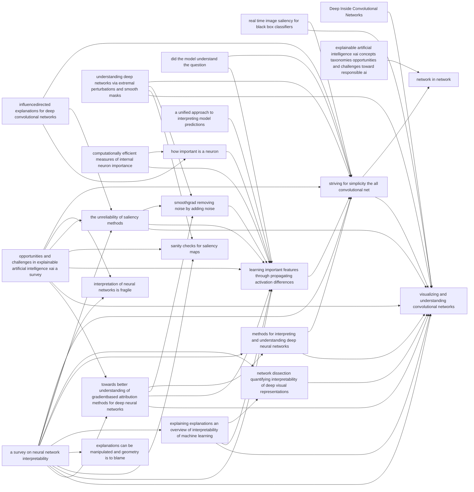

# XAI
```toc
```


```mermaid
graph LR;

Node_0[Deep Inside Convolutional Networks]
Node_23[striving for simplicity the all convolutional net]
Node_27[the unreliability of saliency methods]
Node_3[real time image saliency for black box classifiers]
Node_25[network dissection quantifying interpretability of deep visual representations]
Node_5[understanding deep networks via extremal perturbations and smooth masks]
Node_28[methods for interpreting and understanding deep neural networks]
Node_30[explaining explanations an overview of interpretability of machine learning]
Node_8[explainable artificial intelligence xai concepts taxonomies opportunities and challenges toward responsible ai]
Node_9[did the model understand the question]
Node_21[smoothgrad removing noise by adding noise]
Node_26[how important is a neuron]
Node_12[computationally efficient measures of internal neuron importance]
Node_22[learning important features through propagating activation differences]
Node_14[a unified approach to interpreting model predictions]
Node_15[influencedirected explanations for deep convolutional networks]
Node_32[towards better understanding of gradientbased attribution methods for deep neural networks]
Node_17[a survey on neural network interpretability]
Node_18[opportunities and challenges in explainable artificial intelligence xai a survey]
Node_19[visualizing and understanding convolutional networks]
Node_20[network in network]
Node_24[sanity checks for saliency maps]
Node_29[interpretation of neural networks is fragile]
Node_31[explanations can be manipulated and geometry is to blame]
Node_0 --> Node_19
Node_23 --> Node_20
Node_23 --> Node_19
Node_27 --> Node_21
Node_27 --> Node_22
Node_27 --> Node_19
Node_3 --> Node_23
Node_3 --> Node_19
Node_25 --> Node_19
Node_5 --> Node_23
Node_5 --> Node_21
Node_5 --> Node_24
Node_5 --> Node_19
Node_28 --> Node_23
Node_28 --> Node_19
Node_30 --> Node_25
Node_30 --> Node_22
Node_30 --> Node_19
Node_8 --> Node_20
Node_9 --> Node_23
Node_9 --> Node_22
Node_21 --> Node_22
Node_26 --> Node_22
Node_12 --> Node_26
Node_12 --> Node_22
Node_22 --> Node_23
Node_14 --> Node_22
Node_15 --> Node_23
Node_15 --> Node_27
Node_15 --> Node_26
Node_32 --> Node_28
Node_32 --> Node_21
Node_32 --> Node_22
Node_32 --> Node_19
Node_17 --> Node_23
Node_17 --> Node_29
Node_17 --> Node_27
Node_17 --> Node_25
Node_17 --> Node_28
Node_17 --> Node_30
Node_17 --> Node_31
Node_17 --> Node_24
Node_17 --> Node_22
Node_17 --> Node_19
Node_17 --> Node_32
Node_18 --> Node_23
Node_18 --> Node_29
Node_18 --> Node_27
Node_18 --> Node_24
Node_18 --> Node_22
Node_18 --> Node_19
Node_18 --> Node_32
```

