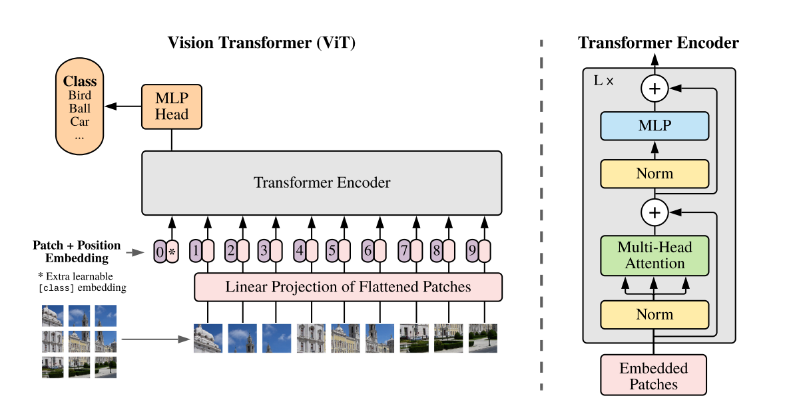

- #architecture
- [paper](https://arxiv.org/abs/2010.11929)
  id:: 62a8a619-06c3-464d-bcbd-4fdf7534d1de
- 
  id:: 62a8a207-b2e6-41dc-ab5c-a47f2a492223
- Transformer applied directly to sequences/patches of images
- Lower computational resources
- [[ImageNet]] , [[CIFAR]], [[VTAB]]

