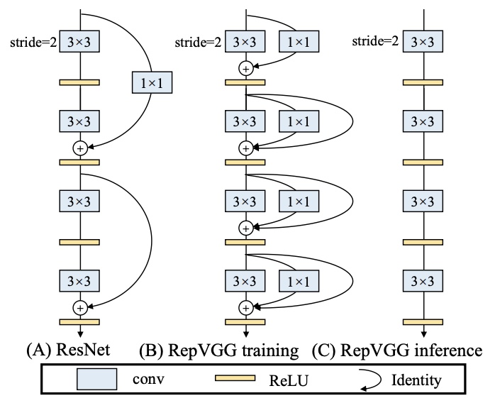

---

toc: true
title: RepVGG

tags: ['temp']

---

# RepVGG
- [RepVGG: Making Vgg-style ConvNets Great Again](https://arxiv.org/abs/2101.03697)
	- stack of $3\times3$ [Conv](Conv.md) and [Relu](Relu.md) during inference time
	- training-time model has a multi-branch topology
	- decoupling of the training-time and inference-time architecture is realized by a structural re-parameterization technique
	- 5 stages and conducts down-[Sampling](Sampling) via stride-2 convolution at the beginning of a stage
	- identity and 1 \times 1 branches, but only for training
	- [ImageNet](ImageNet.md)
	- higher accuracy and show favorable accuracy-speed trade-off compared to the state-of-the-art models like [EfficientNet](EfficientNet.md) and [RegNet](RegNet.md)
	- 

