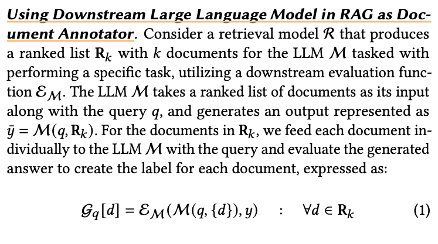
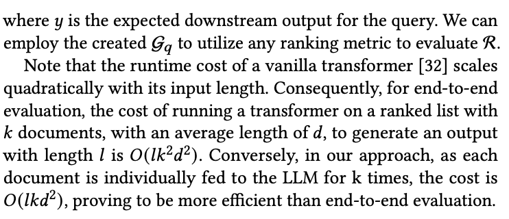
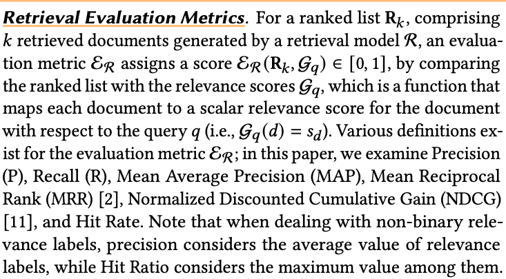
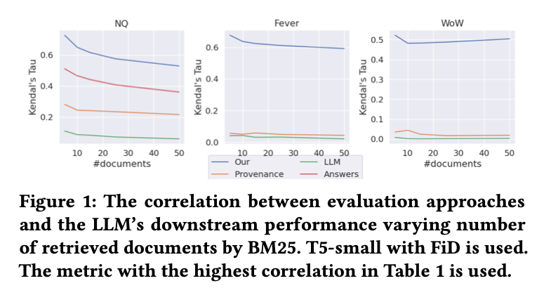

# Salemi and Zamani - 2024 - Evaluating Retrieval Quality in Retrieval-Augmente

- @salemiEvaluatingRetrievalQuality2024

# Evaluating Retrieval Quality in Retrieval-Augmented Generation {#evaluatingretrievalqualityinretrieval-augmentedgeneration}

# Note: Something is Fishy about This Paper.
- Instead of passing end to end, they want to pass documents one by one for evaluation. That seems slightly suspicious how they got so much improvement by doing that :/
- All the part about correlation also seems a little weird.
- Something does not add up about this paper.
- eRAG
- each document in the retrieval list is individually utilized by the large language model within the RAG system
- improvements in Kendall's g correlation ranging from 0.168 to 0.494

## **INTRODUCTION**
- end-to-end evaluation lacks transparency regarding which retrieved document contributed to the generated output, hindering interpretability of the system's behavior
- resource- intensive, consuming signifcant time and computational power, particularly when dealing with a large set of retrieval results con- sumed by the LLM
- many ranking systems rely on interleaving (i.e., replacing one or more documents in the result list) for evaluation and optimization, which further complicates the evaluation, as slight variations in retrieval results necessitate re-computation of the RAG pipeline
- optimizing ranking models often requires document-level feedback, such as user clicks

## **EVALUATING RETRIEVERS IN RAG**
- human judgment to assess the relevance of a query to documents within a corpus
- human annotation can be costly and is often impractical for evaluating all documents in a corpus
- downstream ground truth out- put associated with the query to provide weak relevance labels
- eRAG, a novel approach that involves utilizing the LLM in RAG system itself as the arbiter for generating labels to evaluate the retrieval model.

## **Using Downstream Large Language Model in RAG as Doc- Ument Annotator**

## **Retrieval Evaluation Metrics**

## **Main Findings**
- How do different retrieval evaluation methods correlate with the end-to-end downstream performance in RAG?.
- Interestingly, the most common approaches, KILT Provenance and Annotation with LLMs, that are, document-level relevance labels and using LLMs to assign a relevance label to each retrieved document, have the lowest correlation with the down- stream performance of the LLM
- How do different retrieval evaluation methods in RAG per- form as the size of retrieval results increases?
- varied the number of retrieved documents and computed the correlation between the metric with highest correlation for each method in Table 1 at each specifed number of retrieved documents and the downstream performance of the LLM given that number of retrieved documents

