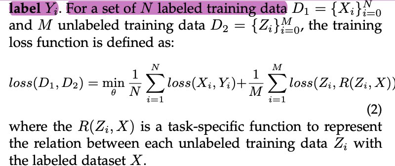

## Semi-Supervised Learning Formulation
- given a small labeled dataset X and a large unlabeled dataset Z, for each data Xi in X, there is a corresponding human-annotated label Yi  
-  
- For a set of N labeled training data

