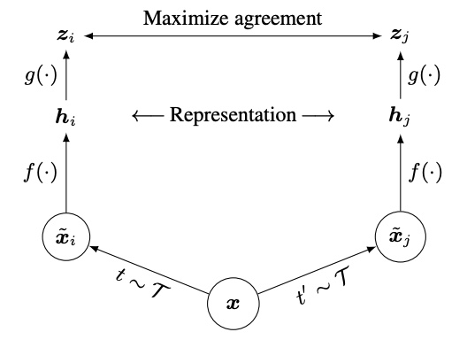

---

toc: true
title: SimCLR

categories: ['temp']

---

# SimCLR
- [A Simple Framework for Contrastive Learning of Visual Representations](https://arxiv.org/abs/2002.05709)
	- contrastive learning of visual representations
	- without requiring specialized architectures or a memory bank
	- composition of data augmentations plays a critical role in defining effective predictive tasks
	- introducing a learnable nonlinear transformation between the representation and the [contrastive loss](Contrastive%20Loss.md) substantially improves the quality of the learned representations
	- contrastive learning benefits from larger batch sizes and more training steps compared to supervised learning
	- use of a nonlinear head at the end of the network, and the [loss](loss.md) function
	- [Res Net](Res%20Net.md)
	- Two separate data [augmentation](Augmentation.md) operators are sampled from the same family of augmentations
	- applied to each data example to obtain two correlated views
	- After training is completed, they throw away the projection head and use the encoder for downstream tasks
	- head $g(\cdot)$
	- encoder $f(\cdot)$
	- representation $h$
	- 

