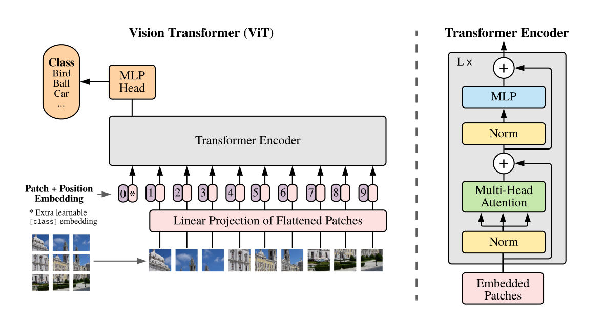

# Vision [Transformer](Transformer.md)
- @dosovitskiyImageWorth16x162021
- [paper](https://arxiv.org/abs/2010.11929)
- 
- [Transformer](Transformer.md) applied directly to sequences/patches of images
- Lower computational resources
- [ImageNet](ImageNet.md) , [CIFAR](CIFAR.md), [VTAB](VTAB.md)
- [Do Vision Transformers See Like Convolutional Neural Networks?](https://arxiv.org/abs/2108.08810)
- analyzes the internal representation structure of ViTs and [Conv](Conv.md) on image classification benchmarks
- striking differences in the [features](Features.md) and internal structures between the two architectures
- ViT having more uniform representations across all [layers](Layers.md)
- early aggregation of global information
- spatial localization
- discovering ViTs successfully preserve input spatial information with CLS tokens
- finding larger ViT models develop significantly stronger intermediate representations through larger pretraining datasets
- [MLP-Mixer](MLP-Mixer)

